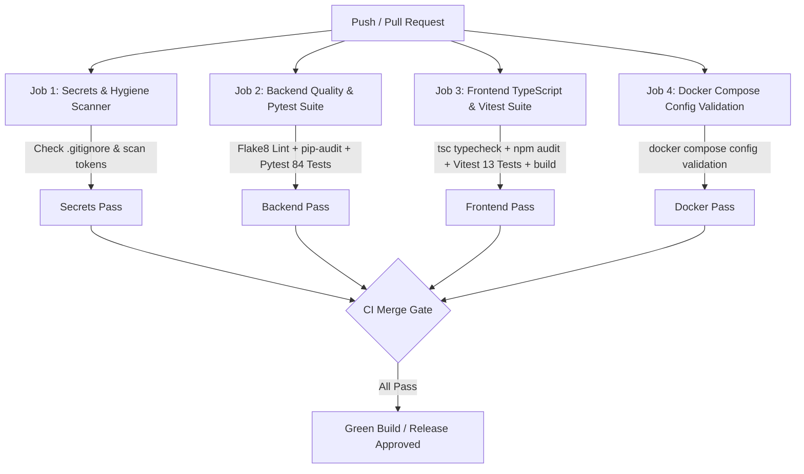
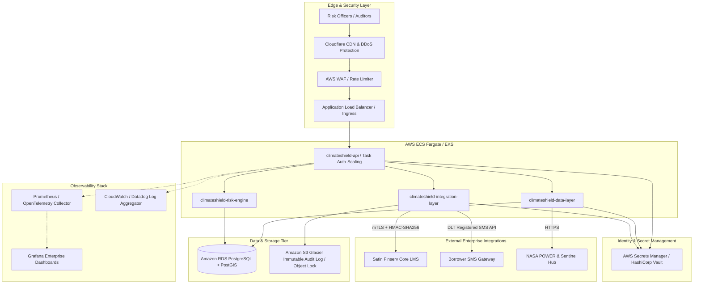

# ClimateShield Deployment, Operations & Production Architecture (`DEPLOYMENT.md`)

This document outlines local single-command deployment, Continuous Integration (CI) validation pipelines, telemetry & monitoring infrastructure, and the target enterprise architecture required for production deployment at an NBFC like Satin Finserv (SFL).

---

## 1. Quick Start: Local Deployment

### 1.1 One-Command Full-Stack Execution (Docker Compose)
ClimateShield orchestrates all five modular architectural layers using Docker Compose:

```bash
# Clone and enter the repository root
git clone <repository-url>
cd climateshield

# Launch the entire 5-layer microservice stack with one command:
docker compose up --build
```

### 1.2 Access Endpoints & Verification
Once initialized, the services will expose the following local network interfaces:

| Service Layer | Container Name | Local Address | Health / Status Endpoint |
| :--- | :--- | :--- | :--- |
| **Presentation Layer** | `climateshield-frontend` | `http://localhost:5173` | UI Dashboard (Browser) |
| **API Gateway** | `climateshield-api` | `http://localhost:8000` | `http://localhost:8000/health` |
| **System Observability** | `climateshield-api` | `http://localhost:8000` | `http://localhost:8000/metrics` |
| **JSON Metrics** | `climateshield-api` | `http://localhost:8000` | `http://localhost:8000/api/v1/metrics/summary` |
| **OpenAPI Documentation** | `climateshield-api` | `http://localhost:8000` | `http://localhost:8000/docs` |
| **Data Layer Daemon** | `climateshield-data-layer` | Internal Network | Monitored via logs & API probe |
| **Risk Engine Daemon** | `climateshield-risk-engine` | Internal Network | Monitored via logs & API probe |
| **Integration Layer Daemon**| `climateshield-integration-layer`| Internal Network | Monitored via logs & audit probe |

To verify health from terminal:
```bash
curl -s http://localhost:8000/health | jq .
```

To stop all services and preserve data volumes:
```bash
docker compose down
```

---

### 1.3 Local Execution Without Docker (Bare-Metal / Developer Mode)

#### Step 1: Install Python Dependencies
```bash
python -m venv .venv
# Activate virtual environment (Windows: .venv\Scripts\activate | Linux/macOS: source .venv/bin/activate)
pip install -e packages/shared/python
pip install -e data-layer
pip install -e risk-engine
pip install -e integration-layer
pip install -e api
```

#### Step 2: Launch Backend API Gateway
```bash
uvicorn api.main:app --host 0.0.0.0 --port 8000 --reload
```

#### Step 3: Launch Frontend Dashboard
```bash
cd frontend
npm install
npm run dev
```

---

## 2. Container Inventory & Microservice Topology

All Dockerfiles reside in [`infra/docker/`](file:///C:/Users/Abdul%20Azeez/.gemini/antigravity/scratch/climateshield/infra/docker) and build on hardened, unprivileged user accounts (`appuser`, UID 10001):

1. **`Dockerfile.api`**:
   - Hardened `python:3.11-slim` image.
   - Installs `climateshield_shared`, `data-layer`, `risk-engine`, `integration-layer`, and `api`.
   - Includes automatic `HEALTHCHECK` probing `GET /health` every 15 seconds.
2. **`Dockerfile.data-layer`**:
   - Executes background climate ingestion worker `python -m data_layer`.
   - Seeds baseline caches and handles POSIX graceful termination (`SIGTERM`, `SIGINT`).
3. **`Dockerfile.risk-engine`**:
   - Executes continuous portfolio anomaly evaluation worker `python -m risk_engine`.
   - Evaluates statistical Z-score thresholds and calibrated scikit-learn zoning models.
4. **`Dockerfile.integration-layer`**:
   - Executes LMS queue processor and audit verifier `python -m integration_layer`.
   - Performs continuous SHA-256 cryptographic chain validation.
5. **`Dockerfile.frontend`**:
   - `node:20-slim` container hosting Vite dev/preview server bound to `0.0.0.0:5173`.

---

## 3. Multi-Environment Configuration & Secrets Management

Configurations are isolated strictly through environment variables. The repository includes explicit template files in [`infra/env/`](file:///C:/Users/Abdul%20Azeez/.gemini/antigravity/scratch/climateshield/infra/env):

- **[`infra/env/.env.dev.example`](file:///C:/Users/Abdul%20Azeez/.gemini/antigravity/scratch/climateshield/infra/env/.env.dev.example)**: Permissive rate limits, mock weather feeds, SQLite persistence, and debug logging.
- **[`infra/env/.env.staging.example`](file:///C:/Users/Abdul%20Azeez/.gemini/antigravity/scratch/climateshield/infra/env/.env.staging.example)**: Pre-production environment enforcing HTTPS HSTS headers, strict rate limits, and external secret injection.
- **[`infra/env/.env.prod.example`](file:///C:/Users/Abdul%20Azeez/.gemini/antigravity/scratch/climateshield/infra/env/.env.prod.example)**: Production template. **Contains zero defaults for secrets.**
- **[`infra/env/CONFIG_SPEC.md`](file:///C:/Users/Abdul%20Azeez/.gemini/antigravity/scratch/climateshield/infra/env/CONFIG_SPEC.md)**: Authoritative matrix of every environment variable, data type, default, and security tier.

### Enforced Zero-Secret Defaults
In [`api/src/api/core/config.py`](file:///C:/Users/Abdul%20Azeez/.gemini/antigravity/scratch/climateshield/api/src/api/core/config.py), the `Settings` class executes an automated Pydantic model validator on startup:
```python
if self.environment in ("staging", "production"):
    if not self.jwt_secret_key or "development-insecure" in self.jwt_secret_key:
        raise ValueError("CRITICAL SECURITY ERROR: jwt_secret_key cannot use default development placeholder in staging/production!")
```
If a deployer attempts to run the container in `staging` or `production` without provisioning high-entropy cryptographic secrets, the service terminates immediately with a non-zero exit code.

---

## 4. Continuous Integration (CI) Pipeline

The CI workflow is defined in [`.github/workflows/ci.yml`](file:///C:/Users/Abdul%20Azeez/.gemini/antigravity/scratch/climateshield/.github/workflows/ci.yml) and runs automatically on every pull request and push to `main` or `master`:



### Quality Gates Enforced:
1. **Secrets Hygiene**: Runs [`scripts/check_secrets.py`](file:///C:/Users/Abdul%20Azeez/.gemini/antigravity/scratch/climateshield/scripts/check_secrets.py) to block any committed API keys, private keys, or `.env` files.
2. **Dependency Vulnerability Scanning**:
   - Python: Runs `pip-audit --desc on` to flag CVEs in installed packages.
   - Node.js: Runs `npm audit --audit-level=critical` to block high/critical vulnerabilities.
3. **Automated Testing**:
   - Backend: Runs all 84 Pytest unit, adversarial, integration, and security tests.
   - Frontend: Runs all 13 Vitest component and end-to-end flow tests.
4. **Compilation & Type Safety**:
   - TypeScript verification and Vite bundle creation (`npm run build`).

---

## 5. Telemetry, Observability & Monitoring

### 5.1 Structured JSON Logging
Configured via `climateshield_shared.telemetry.StructuredJsonFormatter`. Every log entry is serialized as single-line JSON, ready for ingestion by log shippers (Datadog Agent, AWS CloudWatch, Fluentbit, Vector, Promtail/Loki):
```json
{
  "timestamp": "2026-09-09T12:00:00.123456+00:00",
  "level": "INFO",
  "logger": "api.routes.triggers",
  "message": "Climate trigger simulation executed for district Varanasi",
  "service": "climateshield-api",
  "environment": "production",
  "correlation_id": "CORR-8F3B9A1C",
  "context": {
    "district": "Varanasi",
    "borrower_name": "[REDACTED]",
    "account_number": "[REDACTED]"
  }
}
```
**Privacy Redaction**: Any log record containing borrower identifiers (`borrower_name`, `phone`, `pan`, `account_number`, `aadhaar`) is sanitized automatically before serialization.

### 5.2 Metrics Exposition (`/metrics` & `/api/v1/metrics/summary`)
Exposes operational metrics in standard Prometheus exposition format (`text/plain; version=0.0.4`):
- **HTTP Throughput & Status**: `climateshield_http_requests_total{method="POST",endpoint="/api/v1/triggers/simulate",status="200"}`
- **HTTP Latency**: `climateshield_http_request_duration_seconds_sum` and `_count`
- **Error Rates**: `climateshield_http_errors_total{status="429",error_code="RATE_LIMIT_EXCEEDED"}`
- **Climate Triggers**:
  - `climateshield_triggers_evaluated_total{hazard="EXCESS_RAINFALL",district="VARANASI"}`
  - `climateshield_triggers_fired_total{hazard="EXCESS_RAINFALL",district="VARANASI"}`
- **LMS Interventions**:
  - `climateshield_interventions_dispatched_total{relief_type="EMI_MORATORIUM"}`

These endpoints allow a Grafana dashboard or Prometheus instance to scrape and alert on anomaly spikes, error rates, and relief disbursement volume.

---

## 6. Target Production Architecture (Enterprise Blueprint)

To graduate ClimateShield from a hackathon/staging deployment to institutional production at Satin Finserv, the following enterprise infrastructure components must be provisioned:



### 6.1 Enterprise Secret Manager
- **Current**: Environment variables loaded from `.env.dev.example` or staging templates.
- **Production Requirement**: Replace `.env` files with AWS Secrets Manager, Google Secret Manager, or HashiCorp Vault. At container startup, the AWS ECS task definition or Kubernetes external-secrets operator fetches secrets directly into container memory with automated 90-day rotation.

### 6.2 Managed Relational & Geospatial Persistence (PostGIS)
- **Current**: In-memory repository with pre-computed baseline stores.
- **Production Requirement**: Amazon RDS PostgreSQL with the **PostGIS** extension.
  - Borrower MSME geolocations are indexed using spatial `GEOMETRY(Point, 4326)` columns and spatial R-tree indices.
  - Spatial queries like `ST_Contains(district_polygon, borrower_point)` enable sub-district flood and drought hazard zoning down to the village/taluka boundary.

### 6.3 Real Core Banking LMS Integration (mTLS + DLQ)
- **Current**: Pluggable `LMSAdapter` interface with simulated HTTP/HMAC webhook receiver.
- **Production Requirement**:
  - Mutual TLS (mTLS) with client certificates issued by Satin Finserv's Enterprise Certificate Authority.
  - An asynchronous Message Queue (Amazon SQS / Apache Kafka) backing outbound loan-action dispatches.
  - Guaranteed delivery with exponential backoff retries and a Dead-Letter Queue (DLQ) for manual intervention if the core banking system experiences downtime.

### 6.4 Edge CDN, WAF & DDoS Protection
- **Current**: In-process sliding-window rate limiting middleware and defensive HTTP security headers.
- **Production Requirement**:
  - Cloudflare Enterprise or AWS CloudFront with **AWS WAF** positioned ahead of the Application Load Balancer.
  - WAF rules blunting volumetric Layer 7 DDoS attacks, SQLi injection payloads, and enforcing geographic IP whitelisting for SFL office networks.
  - Frontend static assets hosted in Amazon S3 and distributed globally via CloudFront edge caches.
