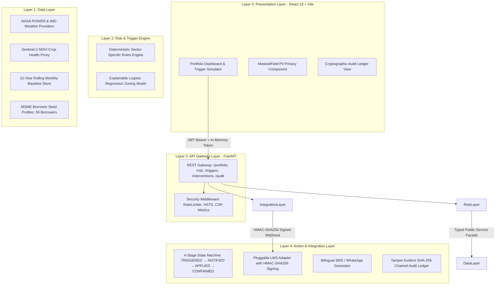

# ClimateShield: Institutional Climate-Risk Intelligence & Parametric Loan Protection

[-00E599?style=flat-square)](./TESTING.md)
[](./SECURITY.md)
[](https://www.python.org/)
[](https://nodejs.org/)
[-FF6B35?style=flat-square)](#)

ClimateShield is an institutional climate-risk intelligence layer embedded directly into MSME credit operations for **Satin Finserv Ltd (SFL)**. It protects vulnerable micro-enterprises across Northern and Central India from localized climate shocks (cloudbursts, unseasonal agricultural droughts, and extreme heatwaves) by continuously monitoring satellite telemetry against borrower locations, evaluating parametric risk models, and triggering automated pre-emptive loan restructuring (EMI moratoriums and emergency liquidity top-ups) via Core Banking LMS integrations.

---

## 1. The Core Operational Loop

```
  ┌────────────────────────────────────────────────────────┐
  │                 1. MONITOR (Data Layer)                │
  │   NASA POWER, IMD Weather Feeds, Sentinel-2 NDVI,     │
  │   and 10-Year Rolling District Climate Baselines       │
  └───────────────────────────┬────────────────────────────┘
                              │
                              ▼
  ┌────────────────────────────────────────────────────────┐
  │              2. ASSESS (Risk & Trigger Engine)         │
  │   Deterministic Parametric Rules + Explainable ML      │
  │   Vulnerability Scoring with Basis-Risk Caveat Flags   │
  └───────────────────────────┬────────────────────────────┘
                              │
                              ▼
  ┌────────────────────────────────────────────────────────┐
  │           3. ACT (Action & Integration Layer)          │
  │   4-Stage LMS State Machine (TRIGGERED → NOTIFIED →    │
  │   APPLIED → CONFIRMED) + HMAC-SHA256 Signed Webhooks   │
  └───────────────────────────┬────────────────────────────┘
                              │
                              ▼
  ┌────────────────────────────────────────────────────────┐
  │            4. LEARN (Audit & Surveillance)             │
  │   Tamper-Evident SHA-256 Chained Ledger + On-Demand    │
  │   Cryptographic Integrity Proofs from Genesis Block    │
  └────────────────────────────────────────────────────────┘
```

---

## 2. 5-Layer Modular Architecture

ClimateShield is structured as a decoupled monorepo where each layer maintains its own package boundaries, dependencies, and typed interfaces:

```
climateshield/
├── packages/shared/python/   # Layer 0: Authoritative schemas (Pydantic V2) & telemetry
├── data-layer/               # Layer 1: Weather/satellite ingestion & baseline cache
├── risk-engine/              # Layer 2: Statistical thresholds & explainable ML zoning
├── api/                      # Layer 3: FastAPI gateway, security middleware & metrics
├── integration-layer/        # Layer 4: LMS webhook adapter, alerts & SHA-256 audit ledger
└── frontend/                 # Layer 5: High-density React 18 + Tailwind CSS dashboard
```



---

## 3. Quickstart: Running Locally

### 3.1 Option A: One-Command Execution with Docker Compose (Recommended)
Launch the entire 5-layer microservice stack with a single command:
```bash
docker compose up --build
```

#### Access Endpoints:
- **Presentation Dashboard**: [http://localhost:5173](http://localhost:5173)
- **API Gateway & Swagger Docs**: [http://localhost:8000/docs](http://localhost:8000/docs)
- **Prometheus Telemetry Metrics**: [http://localhost:8000/metrics](http://localhost:8000/metrics)
- **JSON Metrics Summary**: [http://localhost:8000/api/v1/metrics/summary](http://localhost:8000/api/v1/metrics/summary)
- **Health & Readiness Probe**: [http://localhost:8000/health](http://localhost:8000/health)

---

### 3.2 Option B: Bare-Metal Execution (Developer Mode)

#### 1. Backend Environment Setup:
```bash
# Set up Python virtual environment
python -m venv .venv
# Activate virtual environment (Windows: .venv\Scripts\activate | Linux/macOS: source .venv/bin/activate)

# Install local monorepo packages in editable mode
pip install -e packages/shared/python
pip install -e data-layer
pip install -e risk-engine
pip install -e integration-layer
pip install -e api

# Start the API Gateway
uvicorn api.main:app --host 0.0.0.0 --port 8000 --reload
```

#### 2. Frontend Dashboard Setup:
```bash
cd frontend
npm install
npm run dev
```

---

## 4. Live Demo Walkthrough: The Evaluator User Journey

Follow this step-by-step interactive workflow to experience the complete **Monitor $\rightarrow$ Assess $\rightarrow$ Act $\rightarrow$ Learn** loop:

### Step 1: Authentication & Role Selection
Navigate to [http://localhost:5173](http://localhost:5173). ClimateShield provides pre-seeded accounts:
- **SFL Credit Risk Officer** (`officer_sfl` / `SFLCreditRisk@2026!`): Full operational authority (`credit_team` role).
- **Hackathon Judge / Auditor** (`judge_auditor` / `ViewerJudge@2026!`): Read-only surveillance (`viewer` role).
*Use the instant role toggle in the top-right header to switch roles at any time.*

### Step 2: Explore the Portfolio Climate-Risk Dashboard
1. Review the **4 High-Density KPI Cards**: Monitored Debt Exposure (INR 1.00 Cr+), High-Risk Exposure %, Districts Monitored (7 districts across UP, Bihar, Punjab, Rajasthan), and Active Triggers.
2. Inspect the **District Geospatial Heatmap**: Click on **Varanasi** or **Gorakhpur** to open `DistrictModal.tsx`, inspecting aggregate vulnerability and active borrower count.
3. Use the **Sector Filter** dropdown (e.g., filter by `HANDLOOMS_TEXTILES` or `AGRI_ALLIED`) to observe real-time borrower roster updates.

### Step 3: Configure the Interactive Trigger Simulator
Click **"Trigger Simulator"** in the top navigation:
1. Select **District**: Choose `Varanasi`.
2. Select **Hazard Scenario**: Choose `FLOOD / EXCESS_RAINFALL`.
3. Adjust the **Intensity Multiplier** slider (e.g., set to `1.20x`).
4. Observe the **3-Point Visual Deviation Calculation**:
   - **10-Year Historical Baseline ($\mu$)**: `350.0 mm`
   - **Extreme 95th Percentile Threshold ($P_{95}$)**: `380.0 mm`
   - **Simulated Cloudburst Observation**: `456.0 mm` ($\Delta +20.0\%$)
   - The simulator dynamically flags: **`PARAMETRIC TRIGGER FIRED (EXCESS RAINFALL)`**.

### Step 4: Execute Parametric Dispatch (The "Act" Phase)
Click **"Simulate Climate Trigger"**:
1. The API Gateway orchestrates `RiskEngineService` to assess all 8 MSME borrowers in Varanasi.
2. The engine formulates a proactive relief proposal: **60-Day EMI Moratorium** (`DEFAULT_RELIEF_PERIOD_DAYS_PLACEHOLDER = 60`).
3. `IntegrationService` dispatches simulated LMS loan modifications signed via **HMAC-SHA256** and triggers bilingual (Hindi/English) SMS advisories.
4. A proposal summary banner appears with deep links to the affected intervention records.

### Step 5: Track the LMS 4-Stage State Machine
Click **"Intervention Log"** in the navigation:
1. Verify the newly dispatched records progressing through the authoritative state machine:
   $$\text{TRIGGERED} \quad \longrightarrow \quad \text{NOTIFIED} \quad \longrightarrow \quad \text{APPLIED} \quad \longrightarrow \quad \text{CONFIRMED}$$
2. Click on any intervention row (e.g., `INTV-VARA-...`) to open the **Intervention Dossier Modal**.
3. Inspect the verified HMAC-SHA256 signature header (`X-ClimateShield-Signature`), LMS transaction ID (`LMS-TXN-...`), and stage timestamp audit trail.

### Step 6: Test Borrower PII Masking & Cryptographic Audit Verification
1. Notice that borrower financial identifiers (`Account Number`, `PAN`, `Phone`) are masked by default (`••••••••••••`).
2. Click the **Eye Toggle Icon** on an account number to reveal it. This immediately emits a `SENSITIVE_FIELD_REVEALED` event.
3. Click **"Audit Ledger"** to inspect the live session audit stream recording the reveal action (`actor=user:officer_sfl`).
4. Click **"Verify Cryptographic Ledger"**: The system traverses the SHA-256 parent-hash chain from genesis and displays:
   **`Audit Chain Cryptographically Verified: Zero Tampering Detected`**.

### Step 7: Switch to Read-Only Judge Mode
Toggle your role to **"Hackathon Judge / Auditor"** (`viewer`):
- Return to the **Trigger Simulator**.
- Notice that the dispatch button is locked with an informative banner:
  *`Simulation dispatch requires Credit Team privileges. Currently running in read-only evaluator mode.`*

---

## 5. Verification & Test Suite Summary

ClimateShield includes an exhaustive 97-test automated test suite across all layers, executing with a **100% pass rate**:

```bash
# 1. Run all 84 backend Pytest tests (Unit, Adversarial, Security, Integration):
pytest api/tests risk-engine/tests data-layer/tests integration-layer/tests

# 2. Run all 13 frontend Vitest tests (Components & End-to-End User Flow):
cd frontend && npm test

# 3. Verify zero secrets or credentials in the repository:
python scripts/check_secrets.py

# 4. Verify the frontend production bundle:
cd frontend && npm run build
```

| Subsystem | Tests Executed | Passed | Scope & Scenarios Covered |
| :--- | :---: | :---: | :--- |
| **API Gateway & Security** | 55 | **55 (100%)** | JWT bearer auth, bcrypt, RBAC, sliding-window rate limits, SQLi/XSS rejection, security headers, metrics. |
| **Risk & Trigger Engine** | 13 | **13 (100%)** | 10-year baselines, deterministic rules, ML zoning, hyperthermia shock (>65°C), single-mm P95 precision. |
| **Integration Layer & LMS** | 11 | **11 (100%)** | 4-stage state machine, HMAC-SHA256 webhook signatures, bilingual alerts, SHA-256 audit ledger tamper detection. |
| **Data Layer** | 5 | **5 (100%)** | Coordinate validation, NASA POWER & IMD adapters, Sentinel-2 NDVI modeling, public service facade. |
| **Frontend Component & Flow**| 13 | **13 (100%)** | `MaskedField` privacy, `PortfolioDashboard`, `TriggerSimulator`, `InterventionLog`, and `e2e_flow.test.tsx`. |
| **TOTAL** | **97** | **97 (100%)** | **Complete Full-Stack Verification** |

---

## 6. Authoritative Reference Documents

| Document | Description |
| :--- | :--- |
| **[`JUDGE_FAQ.md`](./JUDGE_FAQ.md)** | **One-Page Evaluator FAQ**: Trigger threshold math, basis-risk mitigation, security architecture, simulated vs. real components, and production roadmap. |
| **[`ARCHITECTURE.md`](./ARCHITECTURE.md)** | Detailed specification of the 5 layers, data flow contracts, and microservice boundaries. |
| **[`SECURITY.md`](./SECURITY.md)** | Threat boundary analysis, PII privacy masking, RBAC policies, and secrets management standards. |
| **[`TESTING.md`](./TESTING.md)** | Full test execution guide, test matrix across 97 tests, and coverage boundaries. |
| **[`DEPLOYMENT.md`](./DEPLOYMENT.md)** | Single-command Docker Compose run, CI pipeline architecture, and enterprise production rollout roadmap. |
| **[`CHANGELOG.md`](./CHANGELOG.md)** | Detailed chronological engineering log across all 10 project modules. |
| **[`CONFIG_SPEC.md`](./infra/env/CONFIG_SPEC.md)** | Exhaustive environment variable dictionary with security tiers and rotation procedures. |
